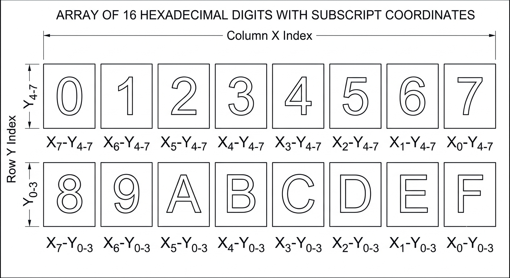
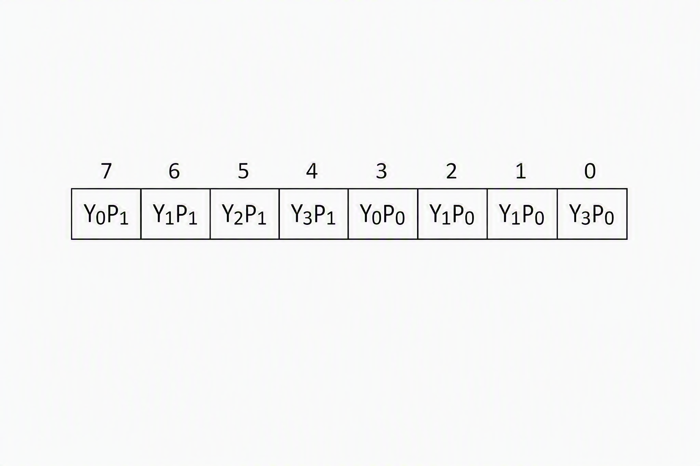
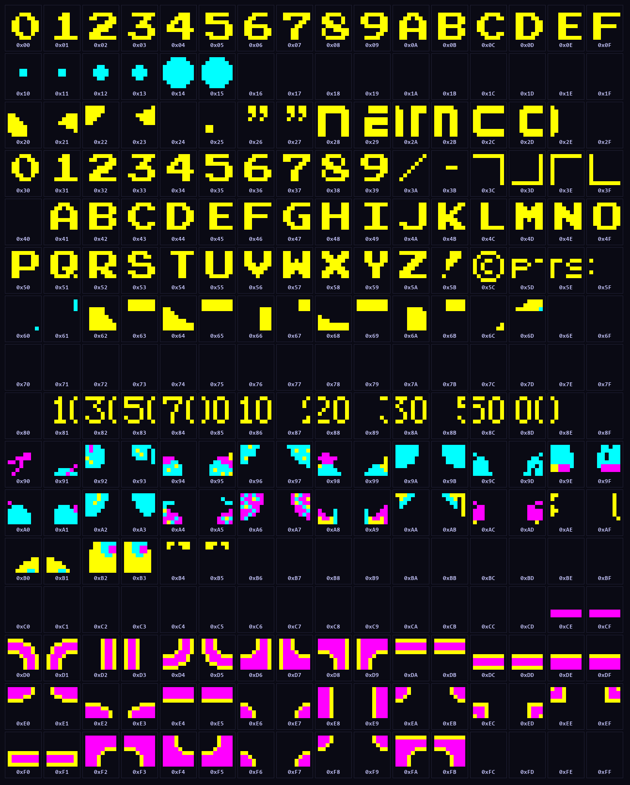
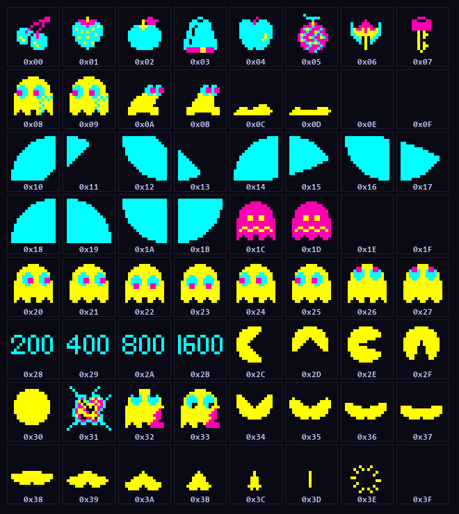
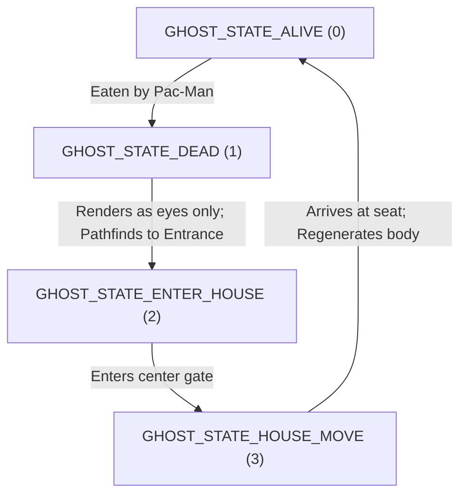

# Pac-Man ROM Graphics & Audio Analysis (5E, 5F, 82s123.7f, 82s126.1m, 82s126.3m & 82s126.4a)

The original physical *Pac-Man* arcade machine uses several PROM and ROM chips to store graphics, colors, and audio waveform data. Below is the detailed analysis of these components.

---

## 1. General Pac-Man graphics. 

The screen consists of a kind of text-display with an overlay of sprites. The text alphabet has 256 symbols and the symbols are stored in tiles in rom 5e.

## 2. Pac-Man ROM 5E (Characters aka Tiles)

### Specifications
- **Size:** 4,096 bytes (4 KB)
- **Format:** 2 bits-per-pixel (2bpp) indexed color graphics
- **Resolution:** 8x8 pixels per tile
- **Capacity:** 256 tiles

### 2.1 Decode Logic and Memory Layout

There are 256 tiles stored sequentialy in the rom. A tile can be found by indexing into (index * 16) the rom and retrieving the 16 bytes containing the graphics data.

1. A tile consist of 16 bytes. 
2. The coding of the tile is complex. The tile is rotated 90 degrees clockwise to make the redering easier on the CRT-tube which is also fitted rotated in the arcade cabinet. 

Each individual byte contains the encoding for plane 0 and plane 1:

 

3. Plane 0 and Plane 1 together form the color encoding for each pixel.

### 2.2 Decoded Character Grid
- **Index `0x00` - `0x8F`:** Alphanumeric digits `0`-`9`, dots and letters `A`-`F`
- **Index `0x90` - `0xCF`:** Special symbols, bonus items, and ghost eyes
- **Index `0xD0` - `0xFF`:** Maze borders, corners, walls

---

## 2. Pac-Man ROM 5F (Sprite Graphics)

### Specifications
- **Size:** 4,096 bytes (4 KB)
- **Format:** 2 bits-per-pixel (2bpp) indexed color graphics
- **Resolution:** 16x16 pixels per sprite
- **Capacity:** 64 sprites (each sprite occupies 64 bytes)

### Decode Logic and Memory Layout
For any sprite index `shape` (0 to 63) and pixel coordinates `(x, y)` (0 to 15) within the 16x16 cell:
1. The 64 bytes representing the sprite are located at `shape * 64`.
2. The byte index `z` (0 to 63) within the sprite block is calculated:
   - Base offset `offset_1 = ((y + 4) & 0x0c) << 1`
   - Horizontal offset `offset_2 = 7 - (x & 7)`
   - Combine: `z = offset_1 + offset_2`
   - If `x < 8` (left half of sprite): `z += 32`
3. The bit planes are extracted:
   - **Plane 0 bit:** `p0 = 1` if `(byte & (0x08 >> (y & 3)))` is non-zero, else `0`
   - **Plane 1 bit:** `p1 = 1` if `(byte & (0x80 >> (y & 3)))` is non-zero, else `0`
4. The pixel color value is: `color_index = (p1 << 1) | p0`

### Decoded Sprite Grid

---

## 4. Pac-Man ROM 82s123.7f (Color Palette)

### Specifications
- **Type:** Bipolar PROM (82s123 or compatible)
- **Size:** 32 bytes (only the first 16 bytes are used by the hardware palette)
- **Format:** 1 byte per color entry, mapped as **2-3-3 RGB** (BBGGGRRR in binary):
  - **Bits 0–2:** Red intensity (0 to 7)
  - **Bits 3–5:** Green intensity (0 to 7)
  - **Bits 6–7:** Blue intensity (0 to 3)

### 4.1 Decoded Palette Table
Using the hardware RGB weighting formulas (R, G multiplied by 36; B multiplied by 85):

| Index | Hex Value | Binary (BBGGGRRR) | Red (raw) | Green (raw) | Blue (raw) | RGB Color | Hex Color | Visual Color | Usage / Role |
| :---: | :---: | :---: | :---: | :---: | :---: | :---: | :---: | :---: | :--- |
| **0** | `0x00` | `00 000 000` | 0 | 0 | 0 | (0, 0, 0) | `#000000` | ████ | Transparent / Black |
| **1** | `0x07` | `00 000 111` | 7 | 0 | 0 | (252, 0, 0) | `#FC0000` | ████ | Red (Blinky / Cherry) |
| **2** | `0x66` | `01 100 110` | 6 | 4 | 1 | (216, 144, 85) | `#D89055` | ████ | Orange-Brown |
| **3** | `0xEF` | `11 101 111` | 7 | 5 | 3 | (252, 180, 255) | `#FCB4FF` | ████ | Pink (Pinky) |
| **4** | `0x00` | `00 000 000` | 0 | 0 | 0 | (0, 0, 0) | `#000000` | ████ | Unused |
| **5** | `0xF8` | `11 111 000` | 0 | 7 | 3 | (0, 252, 255) | `#00FCFF` | ████ | Cyan (Inky) |
| **6** | `0xEA` | `11 101 010` | 2 | 5 | 3 | (72, 180, 255) | `#48B4FF` | ████ | Light Blue (Frightened Ghost) |
| **7** | `0x6F` | `01 101 111` | 7 | 5 | 1 | (252, 180, 85) | `#FCB455` | ████ | Orange (Clyde) |
| **8** | `0x00` | `00 000 000` | 0 | 0 | 0 | (0, 0, 0) | `#000000` | ████ | Unused |
| **9** | `0x3F` | `00 111 111` | 7 | 7 | 0 | (252, 252, 0) | `#FCFC00` | ████ | Yellow (Pac-Man) |
| **10** | `0x00` | `00 000 000` | 0 | 0 | 0 | (0, 0, 0) | `#000000` | ████ | Unused |
| **11** | `0xC9` | `11 001 001` | 1 | 1 | 3 | (36, 36, 255) | `#2424FF` | ████ | Blue (Maze Walls / Eyes) |
| **12** | `0x38` | `00 111 000` | 0 | 7 | 0 | (0, 252, 0) | `#00FC00` | ████ | Green |
| **13** | `0xAA` | `10 101 010` | 2 | 5 | 2 | (72, 180, 170) | `#48B4AA` | ████ | Light Green / Teal |
| **14** | `0xAF` | `10 101 111` | 7 | 5 | 2 | (252, 180, 170) | `#FCB4AA` | ████ | Salmon Pink / Flesh tone |
| **15** | `0xF6` | `11 110 110` | 6 | 6 | 3 | (216, 216, 255) | `#D8D8FF` | ████ | Faded Cyan-White (Frightened flash) |

*Note: Indices 16–31 are all `0x00` (unused padding).*

### 5 Color Table Palette

## 4. Pac-Man ROMs 82s126.1m & 82s126.3m (Sound Waves)

The sound hardware uses custom sound waves stored in two identical bipolar PROMs (1M and 3M). Together, they are loaded into a single contiguous `soundRom` block of 512 bytes:
- **`82s126.1m` (Audio ROM 0):** Loaded at offset `0x0000` (Waveforms 0 to 7)
- **`82s126.3m` (Audio ROM 1):** Loaded at offset `0x0100` (Waveforms 8 to 15)

### Specifications
- **Type:** Bipolar PROM (82s126 or compatible)
- **Size:** 256 bytes per PROM
- **Format:** 4-bit sound amplitude samples, stored at 1 sample per byte (values `0` to `15`, center axis is `8`)
- **Capacity:** 8 waveforms per PROM (each waveform consists of 32 sequential samples: $8 \times 32 = 256$ bytes)

---

### Waveforms in ROM 1M (Waveforms 0 to 7)
Contains the active synthesized waves for standard sound effects:
- **Wave 0 (Bytes 0–31):** Sine Wave Approximation (smooth rising and falling curve)
- **Wave 1 (Bytes 32–63):** Double-Peak Harmonics 1
- **Wave 2 (Bytes 64–95):** Double-Peak Harmonics 2
- **Wave 3 (Bytes 96–127):** Complex Acoustic Waveform
- **Wave 4 (Bytes 128–159):** High-Frequency Fluctuation (rapidly oscillating sound wave)
- **Wave 5 (Bytes 160–191):** Expand-and-Oscillate Triangle (expanding triangular oscillation centered around 7.5)
- **Wave 6 (Bytes 192–223):** Classic Symmetric Triangle Wave (ramps from 0 to 15, then back to 0)
- **Wave 7 (Bytes 224–255):** Sawtooth Wave (two consecutive ramps from 0 to 15)

---

### Waveforms in ROM 3M (Waveforms 8 to 15)
Contains alternate waves. Only the first four waves have data, while the final four are padded with `0x00`:
- **Wave 8 (Bytes 0–31):** Pulse-like Waveform A
- **Wave 9 (Bytes 32–63):** Pulse-like Waveform B (exact duplicate of Wave 8)
- **Wave 10 (Bytes 64–95):** Jagged Pulse Waveform A
- **Wave 11 (Bytes 96–127):** Jagged Pulse Waveform B (exact duplicate of Wave 10)
- **Waves 12–15 (Bytes 128–255):** Unused (Padded entirely with `0x00`)

*Note: In the standard game code, these waveforms (8 to 15) are generally not referenced by active voice effects.*

---

## 5. Pac-Man ROM 82s126.4a (Color Lookup Table)

### Specifications
- **Type:** Bipolar PROM (82s126 or compatible)
- **Size:** 256 bytes (only the first 128 bytes are active/used)
- **Capacity:** 32 color palettes (each palette consists of 4 color index bytes mapping to `82s123.7f` color codes: $32 \times 4 = 128$ bytes)

### Decode Logic
The hardware indexes into this ROM using a combined 7-bit value:
`col_index = (chrCol << 2) | pixel_2bpp`
- `chrCol` is the 5-bit palette ID (0 to 31) written by the CPU to Video/Sprite attribute RAM.
- `pixel_2bpp` is the 2-bit value (0 to 3) representing the raw pixel shape color from graphic ROM `5e` or `5f`.

### Decoded Palette Swatches
Below is the rendered grid of the 32 palettes. Each entry displays its 4 colors (Pixel 0, 1, 2, and 3):

---

## 6. Video RAM (`0x4000 - 0x43FF`) Screen Mapping

The Pac-Man VRAM (Video RAM) contains 1,024 bytes mapping to a physical tile-based monitor of **28 columns** (x = 0 to 27) and **36 rows** (y = 0 to 35) in portrait layout. Because the video processor scans the screen vertically, the VRAM has a highly custom, non-linear mapping scheme.

### Memory Organization Regions
The 1,024-byte VRAM is divided into three distinct segments:

1. **Top HUD Area (2 Rows, $y = 0, 1$):**
   - Mapped as contiguous horizontal rows, read right-to-left.
   - **Row 0 ($y=0$):** CPU addresses `0x43DD` (left side) down to `0x43C2` (right side).
   - **Row 1 ($y=1$):** CPU addresses `0x43FD` (left side) down to `0x43E2` (right side).
2. **Bottom Status Area (2 Rows, $y = 34, 35$):**
   - Mapped as contiguous horizontal rows, read right-to-left.
   - **Row 34 ($y=34$):** CPU addresses `0x401D` (left side) down to `0x4002` (right side).
   - **Row 35 ($y=35$):** CPU addresses `0x403D` (left side) down to `0x4022` (right side).
3. **Main Playfield Area (32 Rows, $y = 2$ to $33$):**
   - Mapped column-by-column rather than row-by-row.
   - Each column is 32 bytes wide, read bottom-to-top.
   - For column `x` (0 to 27) and row `y` (2 to 33):
     $$\text{address} = \text{0x43A0} + (y - 2) - 32 \times x$$
     * **Column 0 ($x=0$):** Addresses `0x43A0` (row 2) to `0x43BF` (row 33).
     * **Column 1 ($x=1$):** Addresses `0x4380` (row 2) to `0x439F` (row 33).
     * ...
     * **Column 27 ($x=27$):** Addresses `0x4000` (row 2) to `0x401F` (row 33).

### Reused VRAM for Sprite Attributes
The "gaps" or unused bytes at the end of each special row block are reused as the **Sprite Attribute Memory (OAM)** at the very end of VRAM:
- **`0x4FF0 - 0x4FFF`:** Maps directly to offset `0x3F0 - 0x3FF` relative to `0x4000`, which contains coordinates and flip configurations for the 8 active sprites.

### Screen Layout Grid Diagram
The following diagram colors the cells by their region and displays the exact hexadecimal Z80 address mapped to each tile coordinates:

---

## 7. Color Attribute RAM (`0x4400 - 0x47FF`)

The Pac-Man Color RAM is a 1,024-byte block of memory located immediately following the Video RAM in the Z80 CPU memory space. It holds the palette configurations for background tiles.

### Memory Organization
* **1:1 Mapping to VRAM:** Every tile position at offset `pos` (0 to `0x3FF`) has its character index stored at Video RAM `0x4000 + pos`, and its color palette settings stored at Color RAM `0x4400 + pos`.
* It follows the **exact same** non-linear 28x36 grid layout as the Video RAM described in Section 6.

### How it Works (Bits 0–4)
For each tile, the byte in Color RAM contains a **5-bit palette ID** in its lower 5 bits (values `0` to `31`):
1. **CPU Write:** The CPU writes the 5-bit color code to `0x4400 + pos`.
2. **Video Pipeline Offset:** The video hardware reads the 5-bit value (`chrCol`) and multiplies it by 4 (shifting left: `chrCol << 2`) to select one of the 32 palettes from the **Color Lookup Table PROM (`82s126.4a`)**.
3. **Pixel Indexing:** For each pixel in the 8x8 tile, the 2-bit color index (0 to 3) from the Graphic ROM `5e` is added to this base offset.
4. **Color Output:** The resulting 7-bit index addresses the lookup PROM `82s126.4a` to retrieve the final 4-bit palette color which indexes the analog RGB color palette PROM `82s123.7f`.

*Note: The upper 3 bits (bits 5–7) of each Color RAM byte are ignored by the standard background character hardware.*

---

## 8. Sprite Attribute Memory (OAM) (`0x4FF0 - 0x4FFF`)

The **Sprite Attribute RAM (OAM)** occupies 16 bytes at the upper end of VRAM. It controls the display properties of the 8 hardware sprites:

### Memory Layout
For each sprite index `i` (from 0 to 7):
* **Byte 0 (`0x4FF0 + i * 2`):** Sprite shape and mirror/flip controls:
  * **Bits 2–7 (6 bits):** Sprite graphic index (0 to 63) inside Sprite ROM `5f`.
  * **Bit 1 (1 bit):** Flip X (`1` = mirror sprite horizontally, `0` = normal rendering).
  * **Bit 0 (1 bit):** Flip Y (`1` = mirror sprite vertically, `0` = normal rendering).
* **Byte 1 (`0x4FF0 + i * 2 + 1`):** Color palette:
  * **Bits 0–4 (5 bits):** Palette ID (0 to 31) pointing to Color Lookup Table `82s126.4a`.

### Render Priority and Sprite Swapping
* **Priority Order:** The video generation chip scans and renders sprites in reverse order from Sprite 7 down to Sprite 0. This gives **Sprite 0 the highest priority** (drawn on top of all other sprites).
* **Power-up Priority Swapping:** Normally, Blinky (Red Ghost) is assigned to Sprite 0 and Pac-Man is assigned to Sprite 4. When Pac-Man eats a power pill and is powered up, the game code swaps their position states in RAM. This shifts Pac-Man to Sprite 0, ensuring he is drawn on top of the blue ghosts when overlapping/eating them.

---

## 9. Cooperative Multi-Tasking Architecture (ISR & Non-ISR Task Queues)

Pac-Man features two separate multitasking task queues: one driven by VBlank interrupts (timed events), and one driven by the main game loop (sequenced events).

### A. The Timekeeper Clock Array (`TIMER_SIXTIETHS`)
At address `0x4C86`, the game maintains a **4-byte Binary Coded Decimal (BCD)** clock:
* **Byte 0:** 60ths of a second (counts $0 \rightarrow 59$)
* **Byte 1:** seconds (counts $0 \rightarrow 59$)
* **Byte 2:** minutes (counts $0 \rightarrow 59$)
* **Byte 3:** hours (counts $0 \rightarrow 99$)

---

### B. Interrupt-Driven Timed Tasks (ISR Tasks, `0x4C90 - 0x4CBF`)
Up to 16 concurrent timed tasks are managed here. The timer countdown byte combines duration with units:
* **Bits 0–5 (Lower 6 bits):** Countdown value (0 to 63).
* **Bits 6–7 (Upper 2 bits):** Time unit mapping:
  * `00` (0) = Frame ticks (decrements every VBlank, 1/60s)
  * `01` (1) = Tenths of a second (decrements every 0.1s)
  * `10` (2) = Seconds (decrements every 1.0s)
  * `11` (3) = Ten-second intervals (decrements every 10.0s)

Once a task's countdown hits `0`, the VBlank handler dispatches it. The original code registers exactly **10 distinct ISR timed tasks**:

| Index | Constant Identifier | Callback Function Name | Operational Role / Event |
| :---: | :--- | :--- | :--- |
| **0** | `ISRTASK_INC_LEVEL_STATE` | `incLevelStateSubr_0894` | Progresses level setup/play transitions |
| **1** | `ISRTASK_INC_MAIN_SUB2` | `incMainSub2_06a3` | Manages demo mode timing states |
| **2** | `ISRTASK_INC_INTRO_STATE` | `incMainStateIntro_058e` | Animates the arcade intro / title screens |
| **3** | `ISRTASK_INC_KILLED_STATE` | `incKilledState_1272` | Progresses Pac-Man's crumpling/death animation frames |
| **4** | `ISRTASK_RESET_FRUIT` | `resetFruit_1000` | Clears fruit sprite from maze when display time ends |
| **5** | *Unnamed / Auxiliary* | `func_100b` | Displays points messages (e.g. "100" or "5000" pts) on screen |
| **6** | `ISRTASK_DISPLAY_READY` | `displayReady_0263` | Displays and blinks the `"READY!"` text on screen |
| **7** | `ISRTASK_INC_SCENE1_STATE` | `incScene1State_212b` | Coordinates cutscene 1 (Giant Blinky sheet torn) |
| **8** | `ISRTASK_INC_SCENE2_STATE` | `incScene2State_21f0` | Coordinates cutscene 2 (Blinky snagged on a nail) |
| **9** | `ISRTASK_INC_SCENE3_STATE` | `incScene3State_22b9` | Coordinates cutscene 3 (Naked Blinky dragging sheet) |

---

### C. Main Loop Sequenced Tasks (Non-ISR Tasks, `0x4CC0 - 0x4CDF`)
Managed as a 16-entry ring buffer (using Z80 CPU registers as pointers `TASK_LIST_BEGIN` and `TASK_LIST_END`). These tasks run sequentially in the main loop without timers. The game maps **32 distinct game engine operations** here:

* **Index 0:** `jumpClearScreen_23ed` — Resets buffers and forces screen redrawing.
* **Index 1 (`TASK_MAZE_COLOURS`):** `mazeColours_24d7` — Alternates the maze colors during level-clear flashing.
* **Index 2:** `drawMaze_2419` — Draws static maze lines/walls.
* **Index 3:** `drawPills_2448` — Draws food dots and power pills.
* **Index 4 (`TASK_INIT_POSITIONS`):** `initialisePositions_25d3` — Sets character start positions.
* **Index 5:** `blinkySubstateTBD_268b` — Logic substate updates for Blinky.
* **Index 6:** `clearColour_240d` — Clears video/color attribute buffers.
* **Index 7:** `resetGameState_2698` — Resets active level and lives counters.
* **Index 8 (`TASK_SCATTER_CHASE_BLINKY`):** `blinkyScatterOrChase_2730` — Executes Blinky AI pathfinding.
* **Index 9:** `pinkyScatterOrChase_276c` — Executes Pinky AI.
* **Index 10:** `inkyScatterOrChase_27a9` — Executes Inky AI.
* **Index 11:** `clydeScatterOrChase_27f1` — Executes Clyde AI.
* **Index 12 (`TASK_HOME_RANDOM_BLINKY`):** `homeOrRandomBlinky_283b` — Movement logic for Blinky inside home gate.
* **Index 13:** `homeOrRandomPinky_2865`
* **Index 14:** `homeOrRandomInky_288f`
* **Index 15:** `homeOrRandomClyde_28b9`
* **Index 16 (`TASK_SETUP_GHOST_TIMERS`):** `setupGhostTimers_000d` — Sets time intervals for ghosts to leave the house.
* **Index 17:** `clearGhostState_26a2` — Clears ghost edible/chase flag statuses.
* **Index 18:** `clearPillArrays_24c9` — Cleets dots array flags.
* **Index 19:** `clearPillsScreen_2a35` — Removes dots from active layout.
* **Index 20 (`TASK_CONFIGURE_GAME`):** `configureGame_26d0` — Checks dip switches and players counts.
* **Index 21:** `updatePillsFromScreen_2487` — Regenerates active dots coordinates.
* **Index 22:** `advanceLevelState_23e8` — Shifts level controllers forward.
* **Index 23 (`TASK_PACMAN_ORIENT`):** `pacmanOrientationDemo_28e3` — Sets Pac-Man's direction in demo.
* **Index 24 (`TASK_CLEAR_SCORES`):** `clearScores_2ae0` — Resets active session scores arrays.
* **Index 25 (`TASK_ADD_TO_SCORE`):** `addToScore_2a5a` — Performs BCD math to increase points counter.
* **Index 26 (`TASK_BOTTOM_COLOUR`):** `bottomTextColourAndDisplayLives_2b6a` — Draws remaining lives symbols.
* **Index 27:** `fruitHistoryLevelCheck_2bea` — Generates active level fruit indices list.
* **Index 28 (`TASK_DISPLAY_MSG`):** `displayMsg_2c5e` — Redraws text strings like READY! or GAME OVER.
* **Index 29:** `displayCredits_2ba1` — Draws coin credits text on HUD.
* **Index 30:** `resetPositions_2675` — Resets player and ghosts to default start slots.
* **Index 31:** `showBonusLifeScore_26b2` — Award animations display calculations.

---

## 10. Memory-Mapped I/O Registers (`0x5000 - 0x50FF`)

The memory space between `0x5000` and `0x50FF` maps directly to hardware ports for handling user inputs, board switches, interrupts, display transformations, and sound synthesis commands:

### Read Ports (Input & Configuration)

#### A. Input Port 0 (`0x5000 - 0x503F`)
Commonly read at address `0x5000` (replicated every 4 bytes). Represents buttons and switches connected to Cabinet Board:
* **Bit 0 (`0x01`):** Player 1 Up
* **Bit 1 (`0x02`):** Player 1 Left
* **Bit 2 (`0x04`):** Player 1 Right
* **Bit 3 (`0x08`):** Player 1 Down
* **Bit 4 (`0x10`):** Rack Advance / Service Test Button (jump level)
* **Bit 5 (`0x20`):** Coin 1 Trigger
* **Bit 6 (`0x40`):** Coin 2 Trigger
* **Bit 7 (`0x80`):** Service Button (Manual credit)

#### B. Input Port 1 (`0x5040 - 0x507F`)
Commonly read at address `0x5040`. Represents player start buttons and cocktail-mode joystick inputs:
* **Bit 0 (`0x01`):** Player 2 Up (Active in cocktail cabinet)
* **Bit 1 (`0x02`):** Player 2 Left
* **Bit 2 (`0x04`):** Player 2 Right
* **Bit 3 (`0x08`):** Player 2 Down
* **Bit 4 (`0x10`):** Service Switch (Cabinet open trigger)
* **Bit 5 (`0x20`):** Player 1 Start Button
* **Bit 6 (`0x40`):** Player 2 Start Button
* **Bit 7 (`0x80`):** Cabinet Mode (`1` = Cocktail Cabinet, `0` = Upright Cabinet)

#### C. Dip Switches (`0x5080 - 0x50BF`)
Commonly read at address `0x5080`. Board-level switches configured by arcade operator:
* **Bits 0–1 (`0x03`):** Coinage Settings:
  * `00` (0) = Free Play
  * `01` (1) = 1 Coin / 1 Credit
  * `10` (2) = 1 Coin / 2 Credits
  * `11` (3) = 2 Coins / 1 Credit
* **Bits 2–3 (`0x0C`):** Initial Player Lives:
  * `00` (0) = 1 Life
  * `01` (1) = 2 Lives
  * `10` (2) = 3 Lives (default)
  * `11` (3) = 5 Lives
* **Bits 4–5 (`0x30`):** Extra Life Score threshold:
  * `00` (0) = 10,000 points
  * `01` (1) = 15,000 points
  * `10` (2) = 20,000 points
  * `11` (3) = Disabled
* **Bit 6 (`0x40`):** Dip switch difficulty (`0` = Hard, `1` = Normal)
* **Bit 7 (`0x80`):** Ghost Names Set (`0` = Alternate names, `1` = Normal names)

---

### Write Ports (Hardware Control)

#### A. Direct Control Lines
* **`0x5000` (Write):** **Interrupt Enable Toggle** — Writing `1` enables Z80 CPU VBlank interrupts (60Hz clock), `0` disables them.
* **`0x5001` (Write):** **Sound Hardware Enable** — Writing `1` enables WSG audio output speaker stage, `0` mutes all sound.
* **`0x5003` (Write):** **Video Screen Flip Toggle** — Writing `1` rotates the entire monitor layout 180 degrees (used in cocktail mode for player 2).

#### B. Namco WSG (Waveform Sound Generator) Registers (`0x5040 - 0x505F`)
Controls three independent voice generators utilizing raw waveform shapes from sound PROMs:

| Voice Channel | Phase Accumulator / Counter (Read/Write) | Waveform Index Select (Bits 0-2) | Pitch Frequency (20 or 16 bits) | Output Volume (Bits 0-3) |
| :---: | :---: | :---: | :---: | :---: |
| **Voice 1** | `0x5040 - 0x5044` (5 nibbles) | `0x5045` | `0x5050 - 0x5054` (20-bit) | `0x5055` (0 to 15) |
| **Voice 2** | `0x5046 - 0x5049` (4 nibbles) | `0x504A` | `0x5056 - 0x5059` (16-bit) | `0x505A` (0 to 15) |
| **Voice 3** | `0x504B - 0x504E` (4 nibbles) | `0x504F` | `0x505B - 0x505E` (16-bit) | `0x505F` (0 to 15) |

*Note: The pitch frequencies are written as 4-bit nibbles, least significant nibble first.*

#### C. Sprite Coordinates (`0x5060 - 0x506F`)
Specifies the screen position coordinates for the 8 active sprites:
- **`0x5060 + i * 2`:** X screen pixel position for sprite `i` (0 to 7)
- **`0x5060 + i * 2 + 1`:** Y screen pixel position for sprite `i` (0 to 7)

#### D. Watchdog Reset (`0x50C0 - 0x50FF`)
Writing any value to this register range kicks/resets the physical hardware watchdog timer circuit. Prevents game locking by automatically resetting the CPU if the game loop fails to execute within the threshold.

---

## 11. ROM-Defined Parameter Tables (Gameplay Mechanics, AI & Sound)

Pac-Man stores several configuration databases in ROM that are loaded into RAM variables and registers at level startup or game event triggers to drive the game loop:

### A. Level Difficulty Index Selector (`DATA_0796` - ROM `0x0796`)
Contains 21 entries of 6 bytes each. Translates the current level number (difficulty index 0 to 20) into sub-table offsets:
* **Byte 0:** Index into speed and mode timings table (`MOVE_DATA_330f`).
* **Byte 1:** Sets relative difficulty index (`REL_DIFF` at `0x4DB0`).
* **Byte 2:** Index into `DATA_0843` (Ghost Leave-House counter thresholds).
* **Byte 3:** Index into `DATA_084F` (Blinky Cruise Elroy dot triggers).
* **Byte 4:** Index into `DATA_0861` (Ghost blue/frightened edible timer duration).
* **Byte 5:** Index into `DATA_0873` (Ghost leaving home inactivity counter).

---

### B. Speed & Ghost Mode Timing Block (`MOVE_DATA_330f` - ROM `0x330F`)
Contains 42-byte configuration entries loaded during level start:
* **Bytes 0–27 (28 bytes): Speed Masks (Step Delays):**
  Defines 32-bit speed pattern masks for Pac-Man and ghosts (normal, edible, and tunnel). A bit set to `1` allows movement on that frame; `0` forces a pause.
* **Bytes 28–41 (14 bytes / 7 words): AI State Transition thresholds (`DIFFICULTY_TABLE`):**
  Contains 7 integer thresholds representing the count of total ghost orientation changes (`ORIENTATION_CHANGE_COUNT`) before transitioning between Scatter and Chase:
  1. Scatter 1 $\rightarrow$ Chase 1
  2. Chase 1 $\rightarrow$ Scatter 2
  3. Scatter 2 $\rightarrow$ Chase 2
  4. Chase 2 $\rightarrow$ Scatter 3
  5. Scatter 3 $\rightarrow$ Chase 3
  6. Chase 3 $\rightarrow$ Scatter 4
  7. Scatter 4 $\rightarrow$ Chase 4 (Permanent chase mode)

---

### C. Ghost House Dot Thresholds (`DATA_0843` - ROM `0x0843`)
Defines the number of dots Pac-Man must eat before the ghosts are allowed to exit the starting house:
* **Level 1 (Entry 0):** Pinky (20), Inky (30), Clyde (70)
* **Level 2 (Entry 1):** Pinky (0), Inky (30), Clyde (60)
* **Level 3 (Entry 2):** Pinky (0), Inky (0), Clyde (50)
* **Level 4+ (Entry 3):** Pinky (0), Inky (0), Clyde (0) (Exits instantly after spawn)

---

### D. Ghost Frightened Edible Timer (`DATA_0861` - ROM `0x0861`)
16-bit values specifying how long (in 60Hz ticks) ghosts stay blue after a power pill is eaten:
* **Entry 0 (Level 1):** `0x03C0` (960 ticks = 16 seconds)
* **Entry 1 (Level 2):** `0x0348` (840 ticks = 14 seconds)
* **Entry 2 (Level 3):** `0x02D0` (720 ticks = 12 seconds)
* **Entry 3 (Level 4):** `0x0258` (600 ticks = 10 seconds)
* **Entry 4 (Level 5):** `0x01E0` (480 ticks = 8 seconds)
* **Entry 5 (Level 6):** `0x0168` (360 ticks = 6 seconds)
* **Entry 6 (Level 7):** `0x00F0` (240 ticks = 4 seconds)
* **Entry 7 (Level 8):** `0x0078` (120 ticks = 2 seconds)
* **Entry 8 (Level 9):** `0x0001` (1 tick = instantaneous flash)
* **Entry 9 (Level 10+):** `0x0000` (Ghosts do not turn blue at all)

---

### E. Ghost Leaving House Inactivity Limits (`DATA_0873` - ROM `0x0873`)
16-bit values specifying the frame count threshold of Pac-Man inactivity (no dots eaten) before a ghost is forced to exit the house:
* **Entry 0 (Level 1):** `240` ticks (4 seconds)
* **Entry 1 (Level 2):** `240` ticks (4 seconds)
* **Entry 2 (Level 3+):** `180` ticks (3 seconds)

---

### F. Blinky Cruise Elroy Remaining Dots (`DATA_084f` - ROM `0x084F`)
Pairs of bytes `(dots_mode_1, dots_mode_2)` indicating how many dots must remain in the maze before Blinky triggers Cruise Elroy:
* **Level 1 (Entry 0):** Mode 1 (20 dots remaining), Mode 2 (10 dots remaining)
* **Level 2 (Entry 1):** Mode 1 (30 dots), Mode 2 (15 dots)
* **Level 3 (Entry 2):** Mode 1 (40 dots), Mode 2 (20 dots)
* **Level 4 (Entry 3):** Mode 1 (50 dots), Mode 2 (25 dots)
* **Level 5 (Entry 4):** Mode 1 (60 dots), Mode 2 (30 dots)

---

### G. Audio & Synthesizer Tables
The sound engine plays tones and effects using data tables located at:
* **`EFFECT_TABLE_CH1_3b30` / `EFFECT_TABLE_CH2_3b40` / `EFFECT_TABLE_CH3_3b80` (Sound Effect Parameter Tables - Address `0x3B30`, `0x3B40`, `0x3B80`):**
  - Defines the audio envelope parameters for sound effects on Channel 1, 2, and 3 respectively.
  - Controls parameters like initial volume, volume delta (rise/fall), frequency offsets, duration of sound, and frequency sweep speed (delta) to synthesize sounds like the waka-waka eating sound, siren pitch sweeps, or ghost eating sound.
* **`SONG_TABLE_CH1_3bc8` / `SONG_TABLE_CH2_3bcc` / `SONG_TABLE_CH3_3bd0` (Music/Intro Song Tables - Address `0x3BC8`, `0x3BCC`, `0x3BD0`):**
  - Contains the musical note note-lengths and note-index lists for the iconic game start intro theme song, played simultaneously on three voice channels.
* **`FREQ_TABLE_3bb8` (Frequency Lookup Table - Address `0x3BB8`):**
  - Maps note values/indexes to their corresponding 20-bit or 16-bit hardware frequency register values for the Namco WSG, allowing the song table notes to be translated into exact pitches.

---

### H. Movement Offsets Vector Table (`0x32FF`)
Maps direction indexes (0: Right, 1: Down, 2: Left, 3: Up) to pixel offset coordinates:
* **Right (`0x32FF`):** `x = 1, y = 0`
* **Down (`0x3301`):** `x = 0, y = 1`
* **Left (`0x3303`):** `x = -1, y = 0`
* **Up (`0x3305`):** `x = 0, y = -1`

---

## 12. Dots Eaten & Ghost House Release Logic

The mechanics of how dots eaten release the ghosts from the house inside the playfield follow two distinct systems depending on whether a life has just started:

### A. Individual Dot Counters (Standard Mode)
During a normal level run where Pac-Man has not died, each ghost in the house has an individual counter that increments only when they are the "next" ghost in the release queue:
1. **Pinky:** Leaves when her counter reaches the limit loaded from `DATA_0843` (e.g. 20 dots on Level 1, 0 on Level 2+).
2. **Inky:** Leaves when his counter reaches the limit (30 dots on Levels 1 & 2, 0 on Level 3+).
3. **Clyde:** Leaves when his counter reaches the limit (70 dots on Level 1, 60 on Level 2, 50 on Level 3, 0 on Level 4+).

### B. Global Dot Counter (`EATEN_PILLS_COUNT` - `0x4D9F`)
If Pac-Man dies, the game temporarily suspends the individual counters and switches to a global counter (`EATEN_PILLS_COUNT`) to speed up game pacing:
* **Pinky** is released when the global counter reaches **7** dots.
* **Inky** is released when the global counter reaches **17** dots.
* **Clyde** is released when the global counter reaches **32** dots.
* Once Clyde exits the house, the game sets `P1_DIED_IN_LEVEL` back to `0`, clears `EATEN_PILLS_COUNT`, and returns to using the standard individual dot counters.

### C. Inactivity Escape Timer
If Pac-Man is not eating any dots (e.g., hiding or trapped), a secondary inactivity timer ticks. If it reaches `UNITS_B4_GHOST_LEAVES_HOME` (typically 3 or 4 seconds, loaded from `DATA_0873`), it immediately forces the next ghost in the queue to leave the house, resetting the inactivity timer.

---

## 13. Ghost Targets & Heading-Home State Transitions

The ghosts update their heading target tiles depending on their state, which determines how they navigate around the maze:

### A. Scatter Mode Corner Target Coordinates
When in Scatter mode, each ghost targets a tile location outside the boundaries of the playfield corners. This causes them to circle their respective corner corridors indefinitely:
* **Blinky (Top-Right):** Targets `{ y = 29, x = 34 }` (Row 34, Column 29)
* **Pinky (Top-Left):** Targets `{ y = 29, x = 57 }` (Row 57, Column 29)
* **Inky (Bottom-Right):** Targets `{ y = 64, x = 32 }` (Row 32, Column 64)
* **Clyde (Bottom-Left):** Targets `{ y = 64, x = 59 }` (Row 59, Column 64)

*Note: In the Z80 CPU layout, coordinates are rotated. `y` maps to the column (0-27) and `x` maps to the row (0-35).*

---

### B. Eaten State & Returning Home Pathfinding
When Pac-Man eats a blue ghost, the entity undergoes a sequence of state transitions to return to the spawn house:

1. **`GHOST_STATE_DEAD` (1):** The ghost becomes a pair of eyes. Its pathfinding target is set to the ghost house entrance coordinates:
   $$\text{Entrance Target} = \{ y = \text{0x2C}, x = \text{0x2E} \}$$
   *(Row 14, Column 12)*
2. **`GHOST_STATE_ENTER_HOUSE` (2):** Once the eyes reach the entrance tile, the ghost state changes to `2`, and the entity moves downward past the gate.
3. **`GHOST_STATE_HOUSE_MOVE` (3):** The ghost moves left or right inside the house to its designated seat.
4. **`GHOST_STATE_ALIVE` (0):** Once seated, the body sprite is restored, and the ghost begins standard house exit checking.

---

## 14. Level-by-Level Behavior & Difficulty Configuration Table (`DATA_0796`)

The primary difficulty settings database starts in ROM at `DATA_0796` (`0x0796`). It consists of 21 entries of 6 bytes, indexed by difficulty level (0 to 20):

| Difficulty Index | level | Speed & Timings Index | Relative Difficulty | Ghost House Dot Index | Cruise Elroy Index | Edible Time Index (Duration) | Inactivity Ticks Index (Inactivity Duration) |
| :---: | :---: | :---: | :---: | :---: | :---: | :---: | :---: |
| **0** | 1 | `03` (Entry 3) | `01` | `01` (Entry 1) | `00` (20/10 dots) | `00` (960 ticks = 16.0s) | `00` (240 ticks = 4.0s) |
| **1** | 2 | `04` (Entry 4) | `01` | `02` (Entry 2) | `01` (30/15 dots) | `01` (840 ticks = 14.0s) | `00` (240 ticks = 4.0s) |
| **2** | 3 | `04` (Entry 4) | `01` | `03` (Entry 3) | `02` (40/20 dots) | `02` (720 ticks = 12.0s) | `01` (240 ticks = 4.0s) |
| **3** | 4 | `04` (Entry 4) | `02` | `03` (Entry 3) | `02` (40/20 dots) | `02` (720 ticks = 12.0s) | `01` (240 ticks = 4.0s) |
| **4** | 5 | `05` (Entry 5) | `00` | `03` (Entry 3) | `02` (40/20 dots) | `03` (600 ticks = 10.0s) | `02` (180 ticks = 3.0s) |
| **5** | 6 | `05` (Entry 5) | `01` | `03` (Entry 3) | `03` (50/25 dots) | `03` (600 ticks = 10.0s) | `02` (180 ticks = 3.0s) |
| **6** | 7 | `05` (Entry 5) | `02` | `03` (Entry 3) | `03` (50/25 dots) | `03` (600 ticks = 10.0s) | `02` (180 ticks = 3.0s) |
| **7** | 8 | `05` (Entry 5) | `02` | `03` (Entry 3) | `03` (50/25 dots) | `03` (600 ticks = 10.0s) | `02` (180 ticks = 3.0s) |
| **8** | 9 | `05` (Entry 5) | `00` | `03` (Entry 3) | `04` (60/30 dots) | `04` (480 ticks = 8.0s)  | `02` (180 ticks = 3.0s) |
| **9** | 10 | `05` (Entry 5) | `01` | `03` (Entry 3) | `04` (60/30 dots) | `03` (600 ticks = 10.0s) | `02` (180 ticks = 3.0s) |
| **10** | 11 | `05` (Entry 5) | `02` | `03` (Entry 3) | `04` (60/30 dots) | `05` (360 ticks = 6.0s)  | `02` (180 ticks = 3.0s) |
| **11** | 12 | `05` (Entry 5) | `02` | `03` (Entry 3) | `04` (60/30 dots) | `06` (240 ticks = 4.0s)  | `02` (180 ticks = 3.0s) |
| **12** | 13 | `05` (Entry 5) | `00` | `03` (Entry 3) | `05` (80/40 dots) | `07` (120 ticks = 2.0s)  | `02` (180 ticks = 3.0s) |
| **13** | 14 | `05` (Entry 5) | `02` | `03` (Entry 3) | `05` (80/40 dots) | `07` (120 ticks = 2.0s)  | `02` (180 ticks = 3.0s) |
| **14** | 15 | `05` (Entry 5) | `01` | `03` (Entry 3) | `05` (80/40 dots) | `05` (360 ticks = 6.0s)  | `02` (180 ticks = 3.0s) |
| **15** | 16 | `05` (Entry 5) | `02` | `03` (Entry 3) | `05` (80/40 dots) | `07` (120 ticks = 2.0s)  | `02` (180 ticks = 3.0s) |
| **16** | 17 | `05` (Entry 5) | `02` | `03` (Entry 3) | `05` (80/40 dots) | `07` (120 ticks = 2.0s)  | `02` (180 ticks = 3.0s) |
| **17** | 18 | `05` (Entry 5) | `02` | `03` (Entry 3) | `05` (80/40 dots) | `07` (120 ticks = 2.0s)  | `02` (180 ticks = 3.0s) |
| **18** | 19 | `05` (Entry 5) | `02` | `03` (Entry 3) | `07` (120/60 dots) | `08` (1 tick = flash only)| `02` (180 ticks = 3.0s) |
| **19** | 20 | `05` (Entry 5) | `02` | `03` (Entry 3) | `07` (120/60 dots) | `08` (1 tick = flash only)| `02` (180 ticks = 3.0s) |
| **20** | 21+ | `06` (Entry 6) | `02` | `03` (Entry 3) | `07` (120/60 dots) | `08` (1 tick = flash only)| `02` (180 ticks = 3.0s) |

---

## 15. Speed & Mode Timings Database Decoded (`MOVE_DATA_330f` - ROM `0x330F`)

This table stores the character speeds and Chase/Scatter timing thresholds. Decoded values:

### A. Chase/Scatter Duration Timing Thresholds (`DIFFICULTY_TABLE`)
For each speed entry index (0 to 6), the Chase/Scatter state transitions occur when the frame counter (`ORIENTATION_CHANGE_COUNT`) matches the thresholds:

- **Entry 3 (Level 1 timings):** `[420, 1620, 2040, 3240, 3540, 4740, 5040]`
  - *Phase 1 (Scatter):* 0 to 420 (7 seconds)
  - *Phase 2 (Chase):* 420 to 1620 (20 seconds)
  - *Phase 3 (Scatter):* 1620 to 2040 (7 seconds)
  - *Phase 4 (Chase):* 2040 to 3240 (20 seconds)
  - *Phase 5 (Scatter):* 3240 to 3540 (5 seconds)
  - *Phase 6 (Chase):* 3540 to 4740 (20 seconds)
  - *Phase 7 (Scatter):* 4740 to 5040 (5 seconds)
  - *Phase 8 (Permanent Chase):* 5040+ (infinite)
- **Entry 4 (Levels 2–4 timings):** `[420, 1620, 2040, 3240, 3540, 65534, 65535]`
  - *Phase 1 (Scatter):* 0 to 420 (7 seconds)
  - *Phase 2 (Chase):* 420 to 1620 (20 seconds)
  - *Phase 3 (Scatter):* 1620 to 2040 (7 seconds)
  - *Phase 4 (Chase):* 2040 to 3240 (20 seconds)
  - *Phase 5 (Scatter):* 3240 to 3540 (5 seconds)
  - *Phase 6 (Permanent Chase):* 3540+ (infinite)
- **Entry 5 & 6 (Levels 5+ timings):** `[300, 1500, 1800, 3000, 3300, 65534, 65535]`
  - *Phase 1 (Scatter):* 0 to 300 (5 seconds)
  - *Phase 2 (Chase):* 300 to 1500 (20 seconds)
  - *Phase 3 (Scatter):* 1500 to 1800 (5 seconds)
  - *Phase 4 (Chase):* 1800 to 3000 (20 seconds)
  - *Phase 5 (Scatter):* 3000 to 3300 (5 seconds)
  - *Phase 6 (Permanent Chase):* 3300+ (infinite)
- **Entry 0 (Alternate timings):** `[600, 1800, 2400, 3600, 4200, 6000, 6420]`
  - *Phase 1 (Scatter):* 0 to 600 (10 seconds)
  - *Phase 2 (Chase):* 600 to 1800 (20 seconds)
  - *Phase 3 (Scatter):* 1800 to 2400 (10 seconds)
  - *Phase 4 (Chase):* 2400 to 3600 (20 seconds)
  - *Phase 5 (Scatter):* 3600 to 4200 (10 seconds)
  - *Phase 6 (Chase):* 4200 to 6000 (30 seconds)
  - *Phase 7 (Scatter):* 6000 to 6420 (7 seconds)
  - *Phase 8 (Permanent Chase):* 6420+ (infinite)
- **Entry 1 (Demo Mode timings):** `[0, 0, 0, 0, 0, 0, 0]` (Instantly transitions to permanent Chase)
- **Entry 2 (Alternate timings):** `[600, 2100, 2520, 4020, 4440, 5640, 5940]`
  - *Phase 1 (Scatter):* 0 to 600 (10 seconds)
  - *Phase 2 (Chase):* 600 to 2100 (25 seconds)
  - *Phase 3 (Scatter):* 2100 to 2520 (7 seconds)
  - *Phase 4 (Chase):* 2520 to 4020 (25 seconds)
  - *Phase 5 (Scatter):* 4020 to 4440 (7 seconds)
  - *Phase 6 (Chase):* 4440 to 5640 (20 seconds)
  - *Phase 7 (Scatter):* 5640 to 5940 (5 seconds)
  - *Phase 8 (Permanent Chase):* 5940+ (infinite)

---

## 16. Pac-Man Z80 CPU Address Space & ROM Mapping Addresses

The original arcade game runs on an 8-bit Z80 microprocessor addressing up to 64 KB of memory space. Program code is mapped directly into CPU memory, whereas graphics and sound registers control physical custom hardware connected to their respective dedicated daughterboards.

### Memory Map Table

| Z80 CPU Address Range | Mapped Component | Component Size | Directly Mapped ROM Files |
| :--- | :--- | :---: | :--- |
| **`0x0000 - 0x0FFF`** | Game Code ROM 0 | 4 KB | `pacman.6e` (Program ROM) |
| **`0x1000 - 0x1FFF`** | Game Code ROM 1 | 4 KB | `pacman.6f` (Program ROM) |
| **`0x2000 - 0x2FFF`** | Game Code ROM 2 | 4 KB | `pacman.6h` (Program ROM) |
| **`0x3000 - 0x3FFF`** | Game Code ROM 3 | 4 KB | `pacman.6j` (Program ROM) |
| **`0x4000 - 0x43FF`** | Video RAM (Tilemap Indices) | 1 KB | *None (Indexed to `pacman.5e` by video hardware)* |
| **`0x4400 - 0x47FF`** | Color attribute RAM | 1 KB | *None (Indexed to `82s123.7f` by video hardware)* |
| **`0x4800 - 0x4FEF`** | CPU Work RAM | ~2 KB | *None* |
| **`0x4FF0 - 0x4FFF`** | Sprite Attribute Memory (OAM) | 16 Bytes | *None (Indexed to `pacman.5f` by sprite hardware)* |
| **`0x5000 - 0x503F`** | Input Registers 0 (Read) | 64 Bytes | *None (Joystick buttons / Coin doors)* |
| **`0x5040 - 0x507F`** | Input Registers 1 (Read) | 64 Bytes | *None (Start buttons / Switches)* |
| **`0x5080 - 0x50BF`** | Dip Switches (Read) | 64 Bytes | *None (Board Configuration Switches)* |
| **`0x5000`** (Write)  | Interrupt Enable Toggle | 1 Byte | *None* |
| **`0x5001`** (Write)  | Sound Hardware Enable | 1 Byte | *None* |
| **`0x5003`** (Write)  | Video Screen Flip Toggle | 1 Byte | *None* |
| **`0x5040 - 0x505F`** (Write) | Custom Sound WSG Registers | 32 Bytes | *None (Registers select voice waves from `82s126.1m` & `126.3m`)* |
| **`0x5060 - 0x506F`** (Write) | Sprite Coordinates (X, Y Positions) | 16 Bytes | *None* |
| **`0x50C0 - 0x50FF`** (Write) | Watchdog Reset registers | 64 Bytes | *None* |

### Hardware ROMs Not Directly Mapped to Z80 Space
Certain graphics and sound PROMs are connected directly to separate bus lanes for custom hardware processors:
1. **Character ROM (`pacman.5e`):** Mapped inside the video controller board. The video processor reads the VRAM coordinates (`0x4000 - 0x43FF`) to fetch the tile indices and draws pixels from this ROM.
2. **Sprite ROM (`pacman.5f`):** Mapped inside the sprite controller hardware. The hardware reads the active sprite attribute table (`0x4FF0 - 0x4FFF`) and coordinate registers (`0x5060 - 0x506F`) to draw moving sprite quadrants.
3. **Color Palette PROM (`82s123.7f`):** Wired directly into the final video DAC output stage to map the digital indices into analog RGB colors.
4. **Color Lookup Table PROM (`82s126.4a`):** Read by the video board to resolve 4-color palettes for each text tile or sprite drawing step.
5. **Sound Wave PROMs (`82s126.1m` / `82s126.3m`):** Wired directly to the Namco custom Waveform Sound Generator (WSG) hardware. The Z80 selects the waveform index and details via the sound register block (`0x5040 - 0x505F`).
